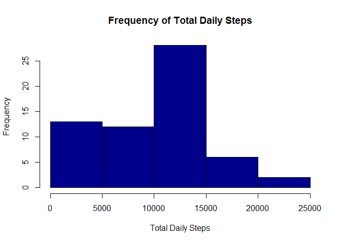
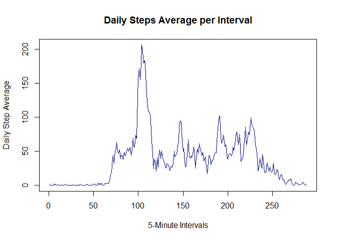
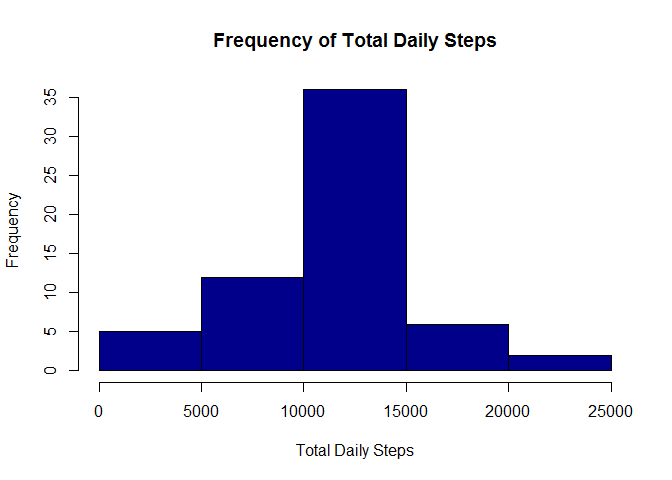
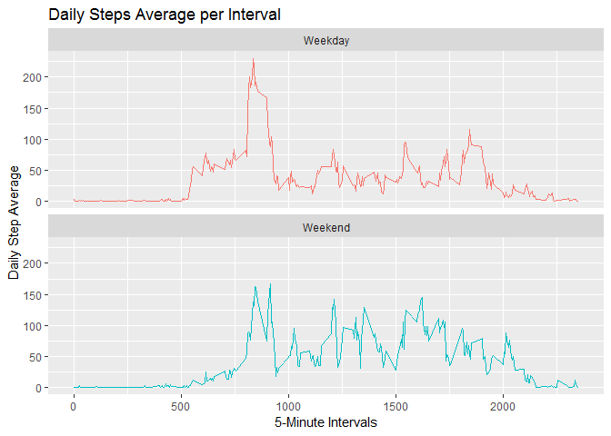

## Loading and preprocessing the data
Here we load the activity dataset and transform the columns into their appropriate data types


```r
activity <- read.csv("./activity.csv", header = TRUE)
activity$date <- as.Date(activity$date)
str(activity)
```

```
## 'data.frame':	17568 obs. of  3 variables:
##  $ steps   : int  NA NA NA NA NA NA NA NA NA NA ...
##  $ date    : Date, format: "2012-10-01" "2012-10-01" ...
##  $ interval: int  0 5 10 15 20 25 30 35 40 45 ...
```

With our processed dataset, we can now answer the assigment questions


## What is mean total number of steps taken per day?
In this part we must first calculate the number of steps taken per day:


```r
dailySteps <- tapply(activity$steps, activity$date, sum, na.rm=TRUE)
head(dailySteps)
```

```
## 2012-10-01 2012-10-02 2012-10-03 2012-10-04 2012-10-05 2012-10-06 
##          0        126      11352      12116      13294      15420
```

Second, create a histogram with the results:


```r
hist(dailySteps, col = "darkblue", xlab = "Total Daily Steps", ylab = "Frequency", main = "Frequency of Total Daily Steps")
```

<!-- -->

And thirdly, identify the mean and the median of our findings:


```r
dailyStepsMean <- mean(dailySteps)
dailyStepsMedian <- median(dailySteps)
```

As a result, when we ignore the missing values, the daily steps average is 9354.2295082 and the daily steps median is 10395.


## What is the average daily activity pattern?
In this part, we must first create a line graph of the 5-minute interval (x-axis) and the average number of steps taken, averaged across all days (y-axis):


```r
intervalStepsMean <- tapply(activity$steps, activity$interval, mean, na.rm = TRUE)
plot(intervalStepsMean, type = "l", col = "darkblue", xlab = "5-Minute Intervals", ylab = "Daily Step Average", main = "Daily Steps Average per Interval")
```

<!-- -->

Then, we must identify which 5-minute interval, on average across all the days in the dataset, contains the maximum number of steps:


```r
maxInterval <- names(intervalStepsMean[which.max(intervalStepsMean)])
```

The interval with the highest average of steps is 835.


## Imputing missing values
In this part, we must first calculate and report the total number of missing values in the dataset:


```r
totalMissing <- sum(is.na(activity$steps))
totalMissing
```

```
## [1] 2304
```

Second, we must devise a strategy for filling in all of the missing values in the dataset and create a new dataset that is equal to the original dataset but with the missing data filled in:


```r
le <- nrow(activity)
activityFull <- activity
for (i in 1:le) 
{
  if (is.na(activityFull[i,1]))
  {
    activityFull[i,1] <- intervalStepsMean[match(activityFull[i,3],as.numeric(names(intervalStepsMean)))]
  }
}
sum(is.na(activityFull$steps))
```

```
## [1] 0
```

```r
head(activityFull)
```

```
##       steps       date interval
## 1 1.7169811 2012-10-01        0
## 2 0.3396226 2012-10-01        5
## 3 0.1320755 2012-10-01       10
## 4 0.1509434 2012-10-01       15
## 5 0.0754717 2012-10-01       20
## 6 2.0943396 2012-10-01       25
```

Lastly, make a histogram of the total number of steps taken each day and calculate and report the mean and median total number of steps taken per day


```r
dailyStepsFull <- tapply(activityFull$steps, activityFull$date, sum)
hist(dailyStepsFull, col = "darkblue", xlab = "Total Daily Steps", ylab = "Frequency", main = "Frequency of Total Daily Steps")
```

<!-- -->

```r
dailyStepsMeanFull <- mean(dailyStepsFull)
dailyStepsMedianFull <- median(dailyStepsFull)
```

As a result, when we ignore the missing values, the daily steps average is 1.0766189\times 10^{4} and the daily steps median is 1.0766189\times 10^{4}.


## Are there differences in activity patterns between weekdays and weekends?
In this part, we must create a new factor variable in the dataset with two levels - "weekday" and "weekend" indicating whether a given date is a weekday or weekend day


```r
weekdays <- c("Monday", "Tuesday", "Wednesday", "Thursday", 
              "Friday")
activityFull$DayType = as.factor(ifelse(is.element(weekdays(activityFull$date),weekdays), "Weekday", "Weekend"))
```

Then, we must make a panel plot containing a time series plot of the 5-minute interval (x-axis) and the average number of steps taken, averaged across all weekday days or weekend days (y-axis).


```r
intervalStepsMeanFull <- aggregate(steps~interval + DayType, activityFull, mean)
library(ggplot2)
```

```
## Warning: package 'ggplot2' was built under R version 3.5.3
```

```r
plot<- ggplot(intervalStepsMeanFull, aes(x = interval , y = steps, color = DayType)) + geom_line() + labs(title = "Daily Steps Average per Interval", x = "5-Minute Intervals", y = "Daily Step Average") + facet_wrap(~DayType, ncol = 1, nrow=2) + theme(legend.position = "none")
print(plot)
```

<!-- -->

From the graph, we can see that the weekends generally have a higher step average than the weekedays, which suggest higher levels of acivity during the weekends.
